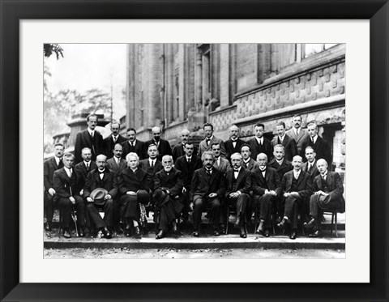

Hi!

International Relations
Open to intern opportunities

Open Source has great power
- ML in energy and finance
- Primary tech stack: Python, C++, Javascript, React, Typescript getting hands dirty with Go
- Experimenting mathematic formulas with code.
- Previously worked on graph neural networks.
- Interested in working on NLP and linguistics

- 

  

